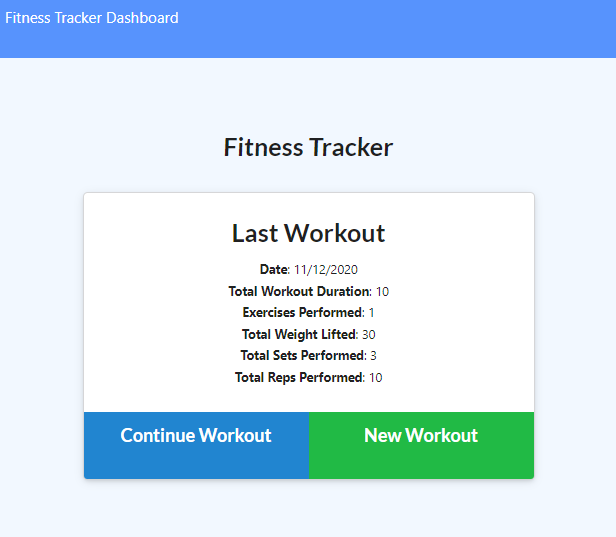

# Homework 17, Fitness Tracker
[](https://creativecommons.org/licenses/by/4.0/)
## Description
In this assignment, the full frontend design was given to us, and we were tasked with building the backend from scratch, using Mongo / Mongoose. Things went fairly well, however I made the fatal decision to also implement support for client-side data caching using indexDB (see [Overly Ambitious Hubris](#Overly%20Ambitious%20Hubris) for a more in depth write-up). That part of the project does not work, but I was able to get pretty far into it before running out of time. Since it doesn't interfere with the online functionality, I deicded to include that code even though it's broken. Maybe someday I could finish it!

When the user loads the page, they should be given the option to create a new workout or continue with their last workout.
The user is be able to:
  * Add new exercises to a previous workout plan.
  * Add new exercises to a new workout plan.
  * View the combined weight of multiple exercises on the `stats` page.

## Table of Contents
* [Description](#description)
* [Live URL](#Live%20URL)
* [Overly Ambitious Hubris](#Overly%20Ambitious%20Hubris)
* [Contribution Instructions](#How%20to%20Contribute)
* [Screenshot](#Screenshot)
* [License](#License)
* [Questions](#Questions)
## Installation Instructions
In the same directory as package.json, type ```npm install```. You will also need to connect a Mongo database.
## Live URL
https://pure-savannah-06685.herokuapp.com/
## How to Contribute
I you have thoughts about how I should have better implemented indexDB (see below) please contact me at benjamin@sixbynine.com.
## Overly Ambitious Hubris
In implementing client-side data caching I ran into two problems that, ultimately, I was unable to solve. For a real-world project, of course, I would never be merging broken code into main like this. However, given that this is a learning environment, I thought it would make sense to show how far I'd gotten and possible get some tips for the future.

The first problem was that the frontend was not designed with any thought to storing data locally. Many of the database calls are missing key info that we would need if we wanted to populate the online database later on. For example, adding exercises to the current workout is not set up to track the _id or the day of the workout. Which works fine in this case, because the data is being sent in right away. But in order to store it and then retrieve and save it later on, we have to add that information back in. Things get messy.
`
A harder problem for me to solve tonight, but an easier problem to solve in general is that the frontend is written using ```async``` style promises, but weall of the indexDB examples we were given use .then() .catch() style functions. This is hardly an insurmountable problem, and a few more hours with Google would surely have allowed me to figure it out, but I ran out of hours.
## Screenshot

## License
License: CC BY 4.0
## Questions
Please contact github@sixbynine.com.
Other projects I've worked on are here: https://github.com/B-Dionysus.
